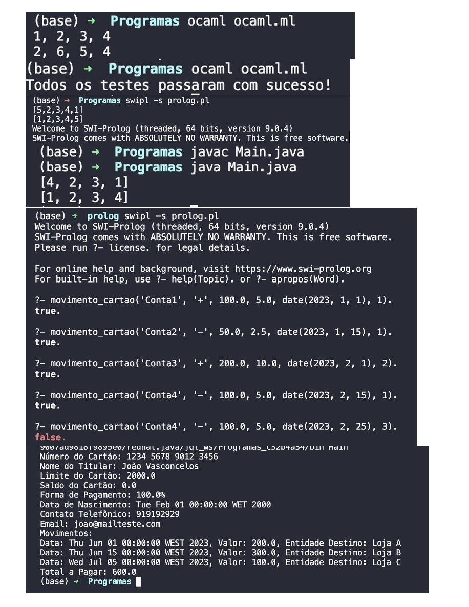

<h1 align="center">
    
</h1>

# Efolio Global em Ocaml, Prolog e Java
  
📌 Linguagens de Programação - EfolioGlobal
Linguagens de Programação OCaml Linguagem Prolog Linguagem Java 

Trabalho a desenvolver
Leia atentamente as seguintes questões e procure responder com o máximo possível de detalhe, explicando de forma detalhada todos os passos do seu raciocínio.
Grupo I
1. Suponha que existem duas listas de números inteiros, não vazias, de tamanhos iguais, e que se pretende verificar se as listas são iguais ao trocar os valores entre o primeiro e último elementos da lista 1 fica igual à lista 2. Caso as listas sejam iguais, retorna a lista 2 senão a lista retornada é a lista 1.
Implemente uma solução, usando as linguagens:
a) O’Caml;
b) Prolog;
c) Java.

Grupo II
1. Considere uma base de conhecimento em Prolog com os factos da seguinte forma:
MovimentoCartao (+contaDestino, +tipoMovimento, +valorMovimento, +valorComissao, +dataMovimento, +pagamentoFracionadoMeses).
Sabendo que as variáveis se referem ao registo de movimentos de um cartão de crédito de um cliente particular de uma empresa de crédito, com a designação da conta destino, o tipo de movimento que pode acumular(+) ou abater(-) no valor total do mês (tais como: pagamento (+) , amortização (-), entre outros), o valor do movimento, o valor de comissão da transação (se houver), a data de movimento, numero de meses de pagamento fracionado (pagamento até 3 vezes), construa um predicado que coloque numa lista o total a pagar mensalmente, indicando o mês, apresentado o resultante na lista os valores acumulados quer na totalidade e fracionados, mostrando apenas os resultados entre as datas solicitadas (+dataInicio, +dataFim):
valoresExtratoEntre_Datas(+dataInicio, +dataFim, -L).

2. Considere uma estrutura de classes em Java para uma plataforma de Cartões de Crédito. Pertencem a esta estrutura as seguintes classes: Conta Cartao e Gestor de Conta Cartao. A classe Conta Cartão tem os seguintes atributos privados: numero de cartao, nome de titular, limite cartao, saldo cartao, forma de pagamento (percentagem de 4% a 100%), data de nascimento, contacto telefonico e email. Esta classe deve considerar os métodos, tais como
ver saldo atual, efetuar movimento (compra ou amortização) com data e valor do movimento, entidade destino do movimento.
Para controlar a utilização do cartão, acresce a outra classe, gestor conta cartao, com os atributos privados: nome do gestor. As funcionalidades existentes desta classe é criar um cartão, ver os dados de um cartão existente.
Crie os métodos públicos necessários para sets e gets em cada uma das classes indicadas, bem como o método efetuar movimento em cartão, e o método construtor com todos os atributos na classe conta cartao. Na classe gestor conta cartao, deve implementar o método resumo mensal para imprimir o resumo dos dados de uma conta cartão, método construtor com a indicação no nome do gestor de conta cartão.

a) Escreva a classe, apenas com a definição das variáveis, os construtores das classes e dos métodos referidos no enunciado.
b) Implemente o método na classe conta cartao para imprimir no ecrã a informação linha a linha por movimento ordenada de forma crescente pela data, mostrando no final o total a pagar. todos atributos e associar um gestor de conta cartão ao mesmo. (se necessário deve acrescentar novas atributos, propriedades nas classes para implementar o proposto na alínea)

------------------

## 

## Sintaxe para executar:
<pre>java -cp .:/caminho/para/o/jpl.jar ArquivoJava</pre> Novamente, substitua /caminho/para/o/jpl.jar pelo caminho completo para o arquivo jpl.jar no seu sistema.

O projeto foi feito em Ocaml, Prolog e Java.

The project was done with Ocaml, Prolog e Java.

🔧 Tecnologias utilizadas:
------------------

- Ocaml
- Prolog
- Java
- VisualStudioCode

💬 Fale comigo
------------------
[*Entre em contato comigo*](https://www.linkedin.com/in/ivo-baptista-3712144/)

